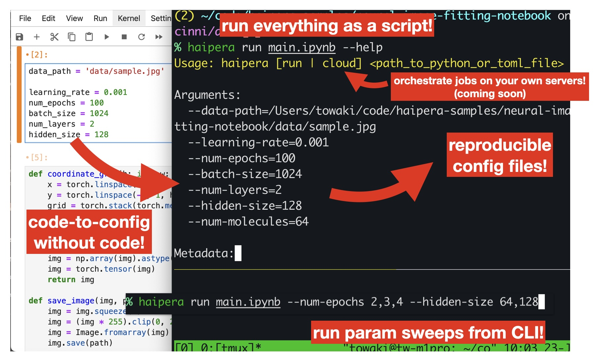

## Paramit: Parameterize Python scripts/notebooks all from the command line

[](https://github.com/haipera/paramit/blob/main/LICENSE)
[](https://github.com/haipera/paramit/stargazers)
[](https://colab.research.google.com/drive/12jY7Kr1Rupj-aJFjlIRgZf1x-nySQdoJ?usp=sharing)
[](https://twitter.com/haipera_ai)

[日本語のREADMEはこちら！](README_JA.md)

**Paramit was recently renamed from Haipera to Paramit. Make sure you `pip uninstall haipera` first.**

Automatically track hyperparameters for your ML models without the boilerplate, and run 100s of experiments all at once, with 1 command.

Built by Haipera.

[Sign up on our waitlist for updates!](https://docs.google.com/forms/d/e/1FAIpQLSer1jjQKapYnNbyBCnpMBB4Nv2kmm7MnFp7t25ISYA7mlH6WA/viewform)

[Join our Discord server!](https://discord.gg/UtHcwJzW)

<p align="center">
    
</p>

## What is Paramit?

Paramit is an open-source framework to take scripts _and_ notebooks and make them **production ready**.

- 🦥 **Config files without any code.** Automatically probes the source code to generate reproducible config files.
- 🤖 **Grid search from CLI.** Use the command line to directly iterate through hyperparameters.
- 🪵 **Automatic experiment logging.** Automatically generates per-experiment output folders with reproducible configs.
- ☁️ **Scale to the Cloud (coming soon!).** Run everything locally, or send your model to Haipera Cloud or your own Cloud for parallel experimentation.

Other general features:

- supports running `.ipynb` notebook files as scripts
- supports running a notebook server (with configs)
- debug as usual with `pdb`
- supports Windows, Linux, OSX
- saves console logs along with configs
- artifacts (images, models, etc) are also saved to separate experiment folders

#### What's next for Paramit?

- bring-your-own-cloud GPU training infrastructure
- automatic logging
- automatic GPU profiling instrumentation
- dashboard for GPU profile analytics w/ LLMs
- experiment management web dashboard

Let us know at info@haipera.com if you have opinions - or if you have dying problems or needs that you want us to hear! We're all ears.

## Getting Started


Install Paramit:

```
pip install paramit
```

If you want to use the notebook hosting, you can do

```
pip install "paramit[notebook]"
```

On Linux, you'll have to install a `venv` package, like:

```
apt install python3.10-venv
```

Make sure you have a `requirements.txt` file where `script.py` or any Python script you want to run is (or alternatively, somewhere in the Git repo for the script).

## Example of using paramit

In a typical project, you may set up a script like:

```python3
import numpy

num_apples = 100
apple_price = 3.0
print("# apples: ", num_apples)
print("price of an apple: ", apple_price)
price = num_apples * apple_price
print("total: ", price)
```

And in the same folder, you may have a `requirements.txt` that lists the dependencies:

```
numpy
```

Say you want to start experimenting with code like this. You'll probably adjust `num_apples` and `apple_price` manually at first, but eventually you'll lose track of what changes caused the differences in the results.

To properly keep track of things, you may write code to load these variables from command line interfaces, set up a notebook, write dense JSON or YAML files, log the outputs in a logging service, save the outputs / configs in a separate experiment folder, etc. There's a lot of grunt work involved in making experimentation reproducible.

Paramit is designed to solve this. With paramit you can edit variables on the fly, which you can view with:

```
paramit run script.py --help
```

By default, paramit will try to use the default `python3` interpreter to run your code. If you want to specify a speciifc Python interpreter to use, set the environment variable:

```
PARAMIT_PYTHON_PATH=/path/to/your/python/interpreter
```

When you run paramit, you can pass in arguments without ever setting up `argparse`:
```
paramit run script.py --num-apples 30
```

This will also generate a `script.toml` configuration file.

You can run these generated config files directly:

```
paramit run script.toml
```

You can also set up grid searches over parameters by:

```
paramit run script.py --num-apples 30,60 --apple-price 1.0,2.0
```

Running `paramit` will also generate a `reports` folder where you run `paramit` from, with isolated experiment outputs in that folder.

You can then re-run existing configs reproducibly with:

```
paramit run reports/experiment/script.toml
```

## Using paramit with Jupyter Notebooks

You can even run paramit with Jupyter notebooks! Using `paramit run` on a notebook file will run the notebook as a script. This is convenient when you want to develop your script inside a notebook environment, but then scale out your runs across a bunch of parameters.

```
paramit run script.ipynb --num-apples 30,40,50
```

If you instead want to spin up a notebook with your chosen config, and have it run in an isolated environment (inside the generated `reports` folder), you can simply run the notebook with `paramit notebook`:

```
paramit notebook script.ipynb --num-apples 30
```

This will start a notebook server as usual with the provided configs, inside a dedicated folder inside `reports`.

This turns out to be a convenient way to do _versioning_ for notebooks- if you have a notebook that you want to use for different data or different examples, instead of cloning 8 versions of the same notebook, you can just have a single notebook and 8 different config files for those notebooks!

You can also run a Python script as a notebook, although usually there are probably not great reasons to do this.

## Demo on Google Colab
You can also try our Google Colab version which allows you to run Paramit in the cloud. Check out our Colab demo using the following notebook: [](https://colab.research.google.com/drive/12jY7Kr1Rupj-aJFjlIRgZf1x-nySQdoJ?usp=sharing)


## More examples

See https://github.com/haipera/haipera-samples for more complex examples that you can try running paramit on.


## Have issues?

Haipera is still in its early stages, so it'll likely to have bugs. We're actively developing haipera, so if you file a GitHub issue or comment in the Discord server or drop us a line at support@haipera.com we will try to resolve them ASAP!
